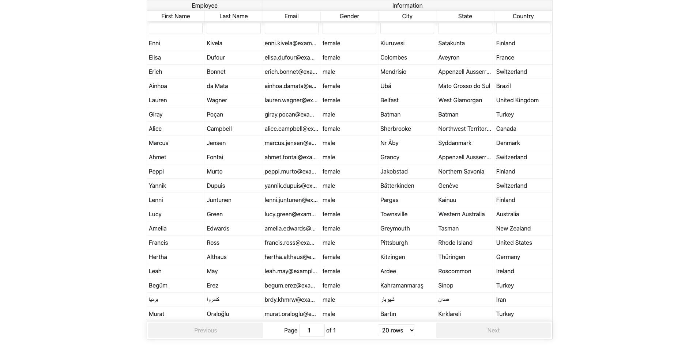
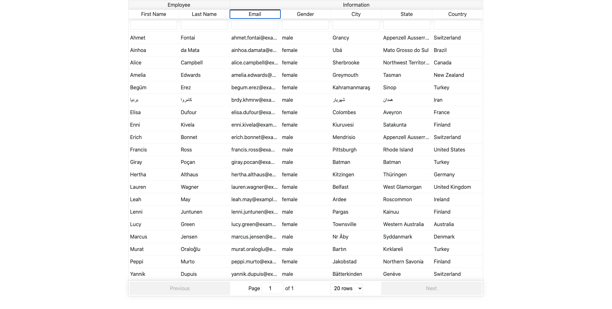
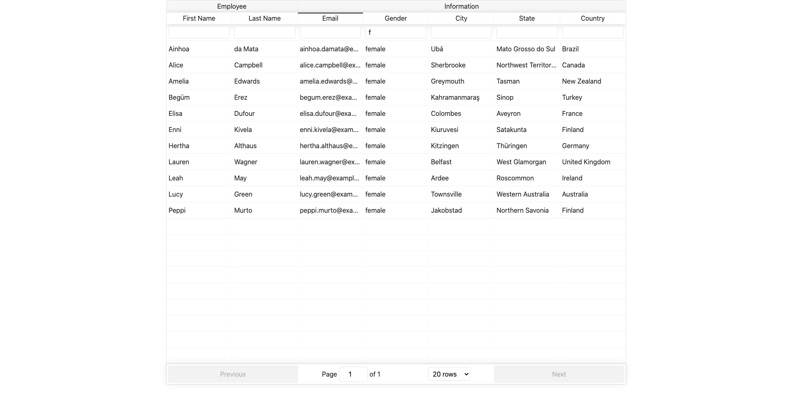

# Employee Directory

This application allows users to view a number of employees and be able to sort and filter the list of employees by any number of options.

It was built using React, along with the npm [React Table](https://www.npmjs.com/package/react-table-v6), and styled using Bootstrap. 

## Testing 

The application is deployed [here](). 

Users are presented with a table that shows a number of employees. Each employee's first and last name, email, gender, city, state, and country is provided as columns of the table. A user can sort each column, with the exception of the `Gender` column. To sort, click the header for the chosen column. The application initially has all columns unsorted. By clicking a header, the table will be first sorted in ascending order, alphabetically, and clicking again will sort the table according to that column in descending order. 

Each column is also filterable, with a text input field given below each header. This allows the user to search for an employee using the given fields. For example, typing "m" in the `Gender` field will filter out any employee that is a female. 

When launched, the application will return 20 employees. At the bottom of the table is an option to show less than 20 rows. If that's the case, then `Previous` and `Next` buttons become active to allow a user to paginate through the table.

## Images

* The start of the application

* Sorting in ascending order by email

* Filtering by gender

 